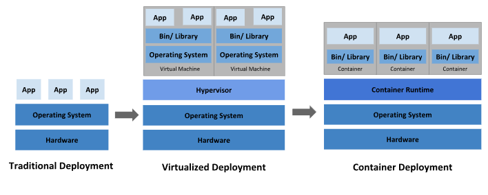

# Introducción a Kubernetes

<p align=center>

</p>

Kubernetes es una plataforma portátil, extensible y de código abierto para gestionar cargas de trabajo y servicios en contenedores, que facilita tanto la configuración declarativa como la automatización. Tiene un ecosistema grande y de rápido crecimiento. Los servicios, el soporte y las herramientas de Kubernetes están ampliamente disponibles.


# Alcance de este curso:

- Retrocidiendo en el tiempo
- Arquitectura
- Instalación
- Contextos
- Imperativo vs Declarativo
- Namespaces
- Pod
- Selectores
- Pods Multi-Contenedores
- ReplicaSet
- Deployments
- Stateful
- Job
- CronJob
- Rolling Updates
- Despliegue azul y verde
- ClusterIP
- NodePort
- LoadBalancer
- Persistence Volumen
- ConfigMap
- Secrets
- LivenessProbe

# Retrocediendo en el timepo

<p align=center>

</p>

 - **Era de implementación tradicional**: Al principio, las organizaciones ejecutaban aplicaciones en servidores físicos. No había forma de definir límites de recursos para las aplicaciones en un servidor físico y esto causaba problemas de asignación de recursos. Por ejemplo, si se ejecutan varias aplicaciones en un servidor físico, puede haber casos en los que una aplicación consumiría la mayor parte de los recursos y, como resultado, las otras aplicaciones tendrían un rendimiento inferior. Una solución para esto sería ejecutar cada aplicación en un servidor físico diferente. Pero esto no creció porque los recursos estaban infrautilizados y a las organizaciones les resultaba costoso mantener muchos servidores físicos.

 - **Era de la implementación virtualizada**: Como solución se introdujo la virtualización. Le permite ejecutar múltiples máquinas virtuales (VM) en la CPU de un único servidor físico. La virtualización permite aislar las aplicaciones entre máquinas virtuales y proporciona un nivel de seguridad ya que otra aplicación no puede acceder libremente a la información de una aplicación. 
 
    La virtualización permite una mejor utilización de los recursos en un servidor físico y permite una mejor escalabilidad porque una aplicación se puede agregar o actualizar fácilmente, reduce los costos de hardware y mucho más. Con la virtualización puedes presentar un conjunto de recursos físicos como un grupo de máquinas virtuales desechables.

    Cada VM es una máquina completa que ejecuta todos los componentes, incluido su propio sistema operativo, sobre el hardware virtualizado.

 -  **Era de implementación de contenedores**: Los contenedores son   similares a las máquinas virtuales, pero tienen propiedades de  aislamiento relajadas para compartir el sistema operativo (SO) entre las aplicaciones. Por tanto, los contenedores se consideran ligeros. Al igual que una máquina virtual, un contenedor tiene su propio sistema de archivos, CPU compartida, memoria, espacio de proceso y más. Como están desacoplados de la infraestructura subyacente, son portátiles a través de nubes y distribuciones de sistema operativo. 

# Arquitectura
Cuando se despliega Kubernetes, se obtiene un clúster.

Un clúster Kubernetes consiste en un conjunto de máquinas de trabajo, llamadas nodos, que ejecutan aplicaciones en contenedores. Cada clúster tiene al menos un nodo trabajador.

El nodo(s) trabajador(es) aloja(n) los Pods que son los componentes de la carga de trabajo de la aplicación. El plano de control gestiona los nodos trabajadores y los Pods en el cluster. En entornos de producción, el plano de control suele ejecutarse en varios ordenadores y un clúster suele ejecutar varios nodos, lo que proporciona tolerancia a fallos y alta disponibilidad.

<p align=center>

</p>

### Componentes del plano de control

Los componentes del plano de control toman decisiones globales sobre el clúster (por ejemplo, programación), así como detectan y responden a eventos del clúster (por ejemplo, iniciar un nuevo pod cuando el campo de réplicas de un despliegue no está satisfecho).

Los componentes del plano de control pueden ejecutarse en cualquier máquina del cluster. Sin embargo, por simplicidad, los scripts de configuración normalmente inician todos los componentes del plano de control en la misma máquina, y no ejecutan contenedores de usuario en esta máquina. Vea Creando clusters altamente disponibles con kubeadm para un ejemplo de configuración del plano de control que corre a través de múltiples máquinas.

### - kube-apiserver
El servidor API es un componente del plano de control de Kubernetes que expone la API de Kubernetes. El servidor API es la interfaz del plano de control de Kubernetes.

La principal implementación de un servidor API de Kubernetes es kube-apiserver. kube-apiserver está diseñado para escalar horizontalmente, es decir, escala desplegando más instancias. Puede ejecutar varias instancias de kube-apiserver y equilibrar el tráfico entre esas instancias.

### - etcd
Almacén de valores clave consistente y de alta disponibilidad utilizado como almacén de respaldo de Kubernetes para todos los datos del clúster.

### - kube-scheduler
Componente del plano de control que busca Pods recién creados sin nodo asignado, y selecciona un nodo para que se ejecuten.

### - kube-controller-manager
Componente del plano de control que ejecuta procesos de controlador. Lógicamente, cada controlador es un proceso independiente, pero para reducir la complejidad, todos se compilan en un único binario y se ejecutan en un único proceso.

Hay muchos tipos diferentes de controladores. Algunos ejemplos son:

- Controlador de nodos: Se encarga de avisar y responder cuando los nodos se caen.
- Controlador de trabajos: Busca objetos Job que representan tareas puntuales y crea Pods para ejecutar esas tareas hasta su finalización.
- Controlador EndpointSlice: Rellena los objetos EndpointSlice (para proporcionar un vínculo entre los servicios y los pods).
- Controlador ServiceAccount: Crea ServiceAccounts por defecto para nuevos espacios de nombres.

### Componentes de nodo
Los componentes de nodo se ejecutan en cada nodo, manteniendo los pods en ejecución y proporcionando el entorno de ejecución de Kubernetes.

### - kubelet
Un agente que se ejecuta en cada nodo del clúster. Se asegura de que los contenedores se están ejecutando en un Pod.

El kubelet toma un conjunto de PodSpecs que se proporcionan a través de diversos mecanismos y se asegura de que los contenedores descritos en esos PodSpecs se están ejecutando y en buen estado. El kubelet no gestiona contenedores que no hayan sido creados por Kubernetes.

### - kube-proxy
kube-proxy es un proxy de red que se ejecuta en cada nodo de su clúster, implementando parte del concepto de Servicio Kubernetes.

kube-proxy mantiene reglas de red en los nodos. Estas reglas de red permiten la comunicación de red a sus Pods desde sesiones de red dentro o fuera de su cluster.

kube-proxy utiliza la capa de filtrado de paquetes del sistema operativo si existe y está disponible. De lo contrario, kube-proxy reenvía el tráfico por sí mismo.

### - Runtime del contenedor
Componente fundamental que permite a Kubernetes ejecutar contenedores de forma eficaz. Se encarga de gestionar la ejecución y el ciclo de vida de los contenedores dentro del entorno Kubernetes.

# Instalación de Kubernetes

 Para crear un cluster de `Kubernetes` localmente utilizaremos `minikube`.  Es una herramienta de código abierto que permite a los usuarios crear y administrar clústeres de Kubernetes en entornos locales o virtuales. Facilita el desarrollo, las pruebas y el aprendizaje de Kubernetes al proporcionar un entorno local que simula las características de producción, sin requerir acceso a un clúster completo en la nube o en un entorno de producción.
 
 ```consola
$ curl -LO https://storage.googleapis.com/minikube/releases/latest/minikube-linux-amd64
   
$ sudo install minikube-linux-amd64 /usr/local/bin/minikube && rm minikube-linux-amd64

$ minikube start

$ minikube dashboard
 ```

Probemos que la instalación de minikube fue exitosa:

    kubectl cluster-info


---
# Componentes de Kubernetes   

## Pod

En Kubernetes, un `nodo` es un servidor, ya sea físico o virtual, que forma parte del clúster. Este nodo actúa como una máquina de trabajo donde se ejecutan las cargas de trabajo. La unidad más pequeña y básica en Kubernetes es el Pod. Un Pod es una abstracción sobre un contenedor. Si estás familiarizado con Docker o imágenes de contenedores, un `Pod` proporciona una capa adicional sobre el contenedor, creando un entorno de ejecución. Kubernetes utiliza esta abstracción para desacoplar la tecnología de contenedores subyacente (como Docker), permitiendo que puedas cambiar el runtime de contenedores si es necesario. Esto significa que no interactúas directamente con Docker o cualquier otra tecnología de contenedores, sino con la capa de Kubernetes.

Un Pod generalmente está diseñado para ejecutar un solo contenedor de aplicación. Sin embargo, es posible ejecutar múltiples contenedores dentro de un mismo Pod, aunque esto suele hacerse cuando hay un contenedor principal y uno o más contenedores auxiliares que brindan servicios complementarios.
---
### Manifest de Pods

En Kubernetes, los *Pods* se crean preferiblemente a través de archivos de configuración llamados *manifests*. Estos archivos, escritos en formato YAML o JSON, describen el estado deseado de los recursos en el clúster. 

Un manifest para un Pod sigue una estructura específica que incluye los siguientes campos clave:

- **`apiVersion`**:  
  Especifica la versión de la API de Kubernetes que se utiliza para crear el objeto. Esto es importante para garantizar la compatibilidad con versiones anteriores y futuras de Kubernetes. Para Pods, la versión de API más común es `v1`.

- **`kind`**:  
  Define el tipo de recurso que se está creando. En este caso, el valor será `Pod`, ya que estamos describiendo un Pod.

- **`metadata`**:  
  Contiene información que identifica de forma única al objeto. Aquí se especifican campos como:
  - **`name`**: El nombre del Pod.
  - **`labels`**: Etiquetas que permiten organizar y seleccionar recursos.
  - **`namespace`**: El espacio de nombres donde se desplegará el Pod (si no se especifica, se usa el espacio de nombres predeterminado).

- **`spec`**:  
  Define el estado deseado del Pod. Aquí se especifican detalles como:
  - Los contenedores que se ejecutarán dentro del Pod.
  - Las imágenes de contenedores que se utilizarán.
  - Los puertos que se expondrán.
  - Las variables de entorno y configuraciones adicionales.

---
## Deployments y ReplicaSets

Aunque es posible crear Pods directamente, en la práctica rara vez se hace. En su lugar, se utilizan abstracciones de nivel superior como *Deployments* para gestionar aplicaciones en Kubernetes. Los Deployments ofrecen funcionalidades avanzadas como escalado, actualizaciones y rollbacks.

### ¿Qué es un Deployment?

Un Deployment es un recurso de Kubernetes que define cómo se deben implementar y gestionar los Pods. Cuando creas un Deployment, este automáticamente crea un **ReplicaSet**, que es el encargado de garantizar que el número deseado de réplicas de un Pod esté siempre en ejecución.


### Estructura de un Deployment

Un manifest para un Deployment sigue una estructura similar a la de un Pod, pero con algunos campos adicionales:

- **`apiVersion`**:  
  Para Deployments, la versión de API más común es `apps/v1`.

- **`kind`**:  
  En este caso, el valor será `Deployment`.

- **`metadata`**:  
  Contiene información como el nombre y las etiquetas del Deployment.

- **`spec`**:  
  Define el estado deseado del Deployment, incluyendo:
  - **`replicas`**:  
    El número de réplicas de Pods que se deben mantener en ejecución.
  - **`selector`**:  
    Define cómo el Deployment identifica los Pods que gestiona (usando etiquetas).
  - **`template`**:  
    Describe el Pod que se creará. Este campo tiene la misma estructura que el manifest de un Pod.

---

### Ejemplo de un manifest para un Deployment

```yaml
apiVersion: apps/v1
kind: Deployment
metadata:
  name: mi-deployment
  labels:
    app: mi-aplicacion
spec:
  replicas: 3
  selector:
    matchLabels:
      app: mi-aplicacion
  template:
    metadata:
      labels:
        app: mi-aplicacion
    spec:
      containers:
      - name: mi-contenedor
        image: nginx:latest
        ports:
        - containerPort: 80
```

Este archivo YAML describe un Deployment llamado `mi-deployment` que mantendrá 3 réplicas de un Pod basado en la imagen `nginx:latest`.

### Funcionalidades de los Deployments

- **Escalado**:  
  Puedes aumentar o reducir el número de réplicas de Pods modificando el campo `replicas` en el manifest.

- **Actualizaciones sin tiempo de inactividad**:  
  Los Deployments permiten actualizar los Pods a una nueva versión de la imagen de contenedor de manera gradual, asegurando que la aplicación siga disponible durante el proceso.

- **Rollbacks**:  
  Si una actualización falla, puedes revertir fácilmente a una versión anterior del Deployment.

---

### ReplicaSets

Un **ReplicaSet** es un recurso de Kubernetes que se encarga de garantizar que un número específico de réplicas de un Pod esté siempre en ejecución. Cuando creas un **Deployment**, este automáticamente genera un **ReplicaSet** para gestionar los Pods. El ReplicaSet monitorea los Pods y asegura que el número actual de réplicas coincida con el número deseado.

---

### Ejemplo de un ReplicaSet creado automáticamente por un Deployment

```yaml
apiVersion: apps/v1
kind: ReplicaSet
metadata:
  name: mi-replicaset
  labels:
    app: mi-aplicacion
spec:
  replicas: 3
  selector:
    matchLabels:
      app: mi-aplicacion
  template:
    metadata:
      labels:
        app: mi-aplicacion
    spec:
      containers:
      - name: mi-contenedor
        image: nginx:latest
        ports:
        - containerPort: 80
```
Este **ReplicaSet** garantiza que siempre haya 3 réplicas del Pod en ejecución.

---
### Resumen

- **Pods**: La unidad más pequeña en Kubernetes, creada a través de manifests que definen su configuración.
- **Deployments**: Una abstracción de nivel superior que gestiona la creación, escalado y actualización de Pods.
- **ReplicaSets**: El componente subyacente que asegura que el número deseado de réplicas de un Pod esté siempre en ejecución.

Al utilizar **Deployments**, puedes aprovechar las ventajas de la automatización, el escalado y la gestión de actualizaciones, lo que hace que sea la forma preferida de implementar aplicaciones en Kubernetes.

## Servicios (Services) e Ingress en Kubernetes

Kubernetes proporciona una red virtual integrada que asigna a cada Pod una dirección IP interna única. Esto permite que los Pods se comuniquen entre sí utilizando estas direcciones IP. Sin embargo, los Pods son **efímeros**, lo que significa que pueden ser eliminados y recreados fácilmente. Cuando esto ocurre, el nuevo Pod obtiene una dirección IP diferente, lo que puede causar problemas si otras aplicaciones dependen de esa IP específica.

### Servicios (Services)

Para resolver este problema, Kubernetes introduce el concepto de **Service**. Un Service es una abstracción que proporciona una dirección IP estática o permanente asociada a un conjunto de Pods. Incluso si un Pod se elimina y se recrea, el Service mantiene su dirección IP, garantizando que las aplicaciones siempre puedan comunicarse con los Pods sin necesidad de ajustes manuales.

#### Tipos de Services

1. **ClusterIP**: Es el tipo predeterminado. Proporciona una IP interna accesible solo dentro del clúster de Kubernetes.
2. **NodePort**: Expone el Service en un puerto específico de cada nodo del clúster, permitiendo el acceso externo.
3. **LoadBalancer**: Crea un balanceador de carga en la nube (si está soportado) para exponer el Service externamente.
4. **ExternalName**: Asocia el Service a un nombre de dominio externo.

#### Casos de Uso

- **Servicios internos**: Por ejemplo, una base de datos que solo debe ser accesible desde dentro del clúster.
- **Servicios externos**: Por ejemplo, una aplicación web que debe ser accesible desde un navegador.

### Ingress

Mientras que los Services permiten exponer aplicaciones externamente, **Ingress** proporciona una capa adicional de control y flexibilidad. En lugar de acceder directamente a un Service mediante una dirección IP y un puerto, el Ingress actúa como un **punto de entrada único** para las solicitudes externas.

#### Funcionalidades de Ingress

- **Enrutamiento basado en nombres de dominio**: Permite usar nombres de dominio personalizados para acceder a diferentes aplicaciones dentro del clúster.
- **Terminación SSL/TLS**: Facilita la configuración de conexiones seguras (HTTPS) para las aplicaciones.
- **Balanceo de carga**: Distribuye el tráfico entre múltiples Services o Pods.

#### Ejemplo de Uso

Supongamos que tienes dos aplicaciones en tu clúster: una aplicación web y una API. Con Ingress, puedes configurar reglas para que:

- `www.tudominio.com` redirija al Service de la aplicación web.
- `api.tudominio.com` redirija al Service de la API.

Además, puedes configurar certificados SSL para asegurar las conexiones.

---

En resumen, los **Services** son esenciales para proporcionar conectividad estable a los Pods, mientras que **Ingress** mejora la accesibilidad y seguridad de las aplicaciones expuestas externamente. Juntos, estos componentes son fundamentales para gestionar el tráfico en un clúster de Kubernetes.
---


## ConfigMap y Secret

En Kubernetes, los Pods suelen comunicarse entre sí utilizando **Services**. Por ejemplo, una aplicación puede conectarse a una base de datos mediante un Service llamado `mongodb-service`. Sin embargo, incluir configuraciones como URLs directamente en el código de la aplicación no es práctico, ya que cualquier cambio requeriría reconstruir la imagen del contenedor y desplegarla nuevamente.

### ConfigMap

Para resolver este problema, Kubernetes introduce **ConfigMap**, que permite externalizar la configuración de la aplicación. Un ConfigMap almacena datos no sensibles, como URLs o variables de entorno, y se conecta al Pod para que este pueda acceder a ellos. Si la URL de la base de datos cambia, solo necesitas actualizar el ConfigMap, sin necesidad de modificar el código o reconstruir la imagen.

### Secret

Para datos sensibles, como contraseñas o credenciales, Kubernetes ofrece **Secret**. Similar a un ConfigMap, un Secret almacena información, pero en formato codificado (Base64). Aunque esto no es un cifrado robusto, Kubernetes permite integrar herramientas de terceros (como las de proveedores de nube) para cifrar los Secrets y mejorar su seguridad.

---

En resumen:
- **ConfigMap**: Para configuraciones no sensibles.
- **Secret**: Para datos sensibles, con opciones adicionales de cifrado.

---
## Volúmenes (Volumes)

En Kubernetes, los Pods y contenedores son efímeros, lo que significa que los datos almacenados en ellos se pierden cuando el Pod se reinicia. Esto es un problema para aplicaciones como bases de datos, donde la persistencia de datos es crucial.

Para resolver esto, Kubernetes introduce el concepto de **Volúmenes**. Un Volumen es un almacenamiento físico que se adjunta a un Pod, ya sea en el mismo nodo (almacenamiento local) o en un sistema remoto (como un servicio de almacenamiento en la nube). Cuando un Pod se reinicia, los datos almacenados en el Volumen permanecen intactos.

Es importante destacar que Kubernetes no gestiona la persistencia de datos por sí mismo. El almacenamiento se considera externo al clúster, por lo que es responsabilidad del administrador asegurar que los datos estén respaldados y replicados adecuadamente.

---

## Deployment y StatefulSet

En un entorno de producción, es fundamental evitar el tiempo de inactividad. Si un Pod de aplicación muere, los usuarios no podrán acceder al servicio. Para abordar esto, Kubernetes permite replicar los Pods utilizando el componente **Deployment**. Un Deployment es una plantilla que define cómo deben crearse y gestionarse los Pods, incluyendo el número de réplicas. Si un Pod muere, el Deployment asegura que se cree una nueva réplica automáticamente.

Sin embargo, no todas las aplicaciones pueden gestionarse con Deployments. Las bases de datos, por ejemplo, son aplicaciones con estado (**stateful**), lo que significa que necesitan acceso a un almacenamiento compartido y sincronizado. Para estos casos, Kubernetes ofrece el componente **StatefulSet**, que gestiona la replicación y sincronización de los Pods, asegurando que los datos no se corrompan.

Aunque es posible ejecutar bases de datos en Kubernetes usando StatefulSets, muchos equipos prefieren alojarlas fuera del clúster debido a la complejidad que implica su gestión.

---

## Configuración de Kubernetes

En Kubernetes, toda la configuración se realiza a través del **API Server**, que es el punto de entrada principal al clúster. Los usuarios pueden enviar solicitudes de configuración en formato **YAML** o **JSON** utilizando herramientas como `kubectl`. Estas solicitudes son **declarativas**, lo que significa que especificas el estado deseado del clúster, y Kubernetes se encarga de alcanzar y mantener ese estado.

### Estructura de un archivo de configuración

Un archivo de configuración típico en Kubernetes consta de tres partes principales:

1. **Metadata**: Contiene información básica, como el nombre del componente y etiquetas.
2. **Specification (Spec)**: Define la configuración deseada del componente (por ejemplo, número de réplicas, imágenes de contenedores, etc.).
3. **Status**: Es generado automáticamente por Kubernetes para reflejar el estado actual del componente.

Kubernetes compara constantemente el **estado deseado** (definido en el archivo de configuración) con el **estado actual** (reflejado en el Status) y realiza ajustes para mantener la coherencia. Esta es la base de la función de **autocuración** de Kubernetes.

### Infraestructura como Código (IaC)

Los archivos de configuración de Kubernetes suelen almacenarse junto con el código de la aplicación, siguiendo el concepto de **Infraestructura como Código (IaC)**. Esto permite versionar, revisar y gestionar la infraestructura de la misma manera que el código de la aplicación.

---