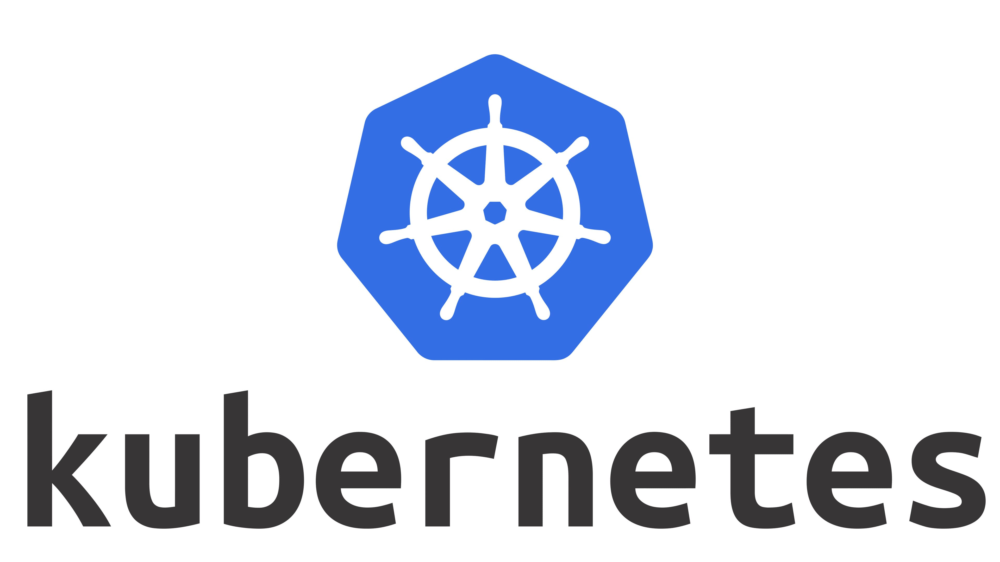

# Introducción a Kubernetes

Kubernetes es una plataforma portátil, extensible y de código abierto para gestionar cargas de trabajo y servicios en contenedores, que facilita tanto la configuración declarativa como la automatización. Tiene un ecosistema grande y de rápido crecimiento. Los servicios, el soporte y las herramientas de Kubernetes están ampliamente disponibles.

# Alcance de este curso:

- Retrocidiendo en el tiempo
- Arquitectura
- Instalación
- Contextos
- Imperativo vs Declarativo
- Namespaces
- Pod
- Selectores
- Pods Multi-Contenedores
- ReplicaSet
- Deployments
- Stateful
- Job
- CronJob
- Rolling Updates
- Despliegue azul y verde
- ClusterIP
- NodePort
- LoadBalancer
- Persistence Volumen
- ConfigMap
- Secrets
- LivenessProbe

# Retrocediendo en el timepo

 - **Era de implementación tradicional**: Al principio, las organizaciones ejecutaban aplicaciones en servidores físicos. No había forma de definir límites de recursos para las aplicaciones en un servidor físico y esto causaba problemas de asignación de recursos. Por ejemplo, si se ejecutan varias aplicaciones en un servidor físico, puede haber casos en los que una aplicación consumiría la mayor parte de los recursos y, como resultado, las otras aplicaciones tendrían un rendimiento inferior. Una solución para esto sería ejecutar cada aplicación en un servidor físico diferente. Pero esto no creció porque los recursos estaban infrautilizados y a las organizaciones les resultaba costoso mantener muchos servidores físicos.

 - **Era de la implementación virtualizada**: Como solución se introdujo la virtualización. Le permite ejecutar múltiples máquinas virtuales (VM) en la CPU de un único servidor físico. La virtualización permite aislar las aplicaciones entre máquinas virtuales y proporciona un nivel de seguridad ya que otra aplicación no puede acceder libremente a la información de una aplicación. 
 
    La virtualización permite una mejor utilización de los recursos en un servidor físico y permite una mejor escalabilidad porque una aplicación se puede agregar o actualizar fácilmente, reduce los costos de hardware y mucho más. Con la virtualización puedes presentar un conjunto de recursos físicos como un grupo de máquinas virtuales desechables.

    Cada VM es una máquina completa que ejecuta todos los componentes, incluido su propio sistema operativo, sobre el hardware virtualizado.

 -  **Era de implementación de contenedores**: Los contenedores son   similares a las máquinas virtuales, pero tienen propiedades de  aislamiento relajadas para compartir el sistema operativo (SO) entre las aplicaciones. Por tanto, los contenedores se consideran ligeros. Al igual que una máquina virtual, un contenedor tiene su propio sistema de archivos, CPU compartida, memoria, espacio de proceso y más. Como están desacoplados de la infraestructura subyacente, son portátiles a través de nubes y distribuciones de sistema operativo. 

# Arquitectura
